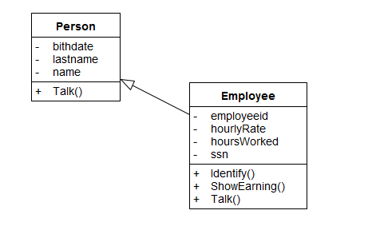
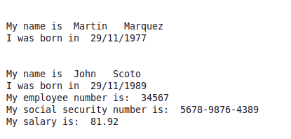

# Understanding OOP Inheritance with Python

One of the most common goals for the OOP is code reusability. Characteristics such as inheritance contributes to achieving this goal.

<h3>Inheritance</h3>

Inheritance is the most used mechanism to optimise the coding, since it allows to reuse methods defined in superclasses, to define new subclasses. The following example uses the class Person as its superclass.

Fig 1. Inheritance in a UML Class diagram

We know that a person also can be an employee in addition to talking, and Employee can show its earnings so we will declare a class called Employee.
Who inherits the talk() method of the Person class to implement inheritance in this example:

You will notice how the "John" object, which is now an instance of Employee continues to behave as an instance of Person because it has inherited its methods.

Run the example with the following command
<pre>
py Sample1OOP.py
</pre>
Fig 2. Running the example.

